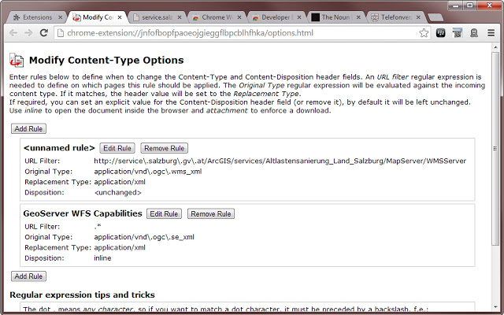

### [Modify Content-Type - Extended](https://github.com/warren-bank/crx-modify-content-type)

Chrome extension that allows manipulation of the Content-Type and Content-Disposition HTTP header fields of incoming documents.

This may be helpful if you like to force the browser to either show a document inside the browser window or to offer it as a download.
It also can be used to override unknown mime types sent by misconfigured servers.

#### Forked from:

* [Modify Content-Type](https://chrome.google.com/webstore/detail/modify-content-type/jnfofbopfpaoeojgieggflbpcblhfhka)
  - version: 0.2
    * date: 2013-11-15
    * size: 41.58 KB
  - by: [Daniel Calliess](https://github.com/flansch)

#### Updates:

* readability:
  - reorganized directory structure
  - cleaned up code whitespace/formatting
* security audit:
  - replaced vendor libraries with clean copies from official CDN

#### Roadmap:

* refactoring:
  - remove jQuery from background script (not needed)
* new features:
  - ability to backup and restore rules to/from an external text file in JSON format

#### Screenshots:

